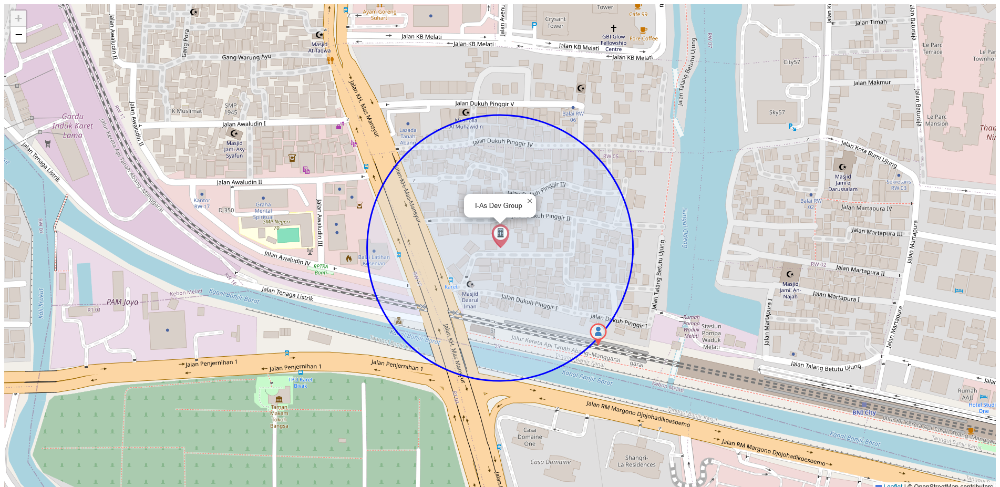

# Radius Checker API w/ Map Preview

A simple Express.js based application that checks whether a user is within a certain radius of the office, complete with map visualization using Leaflet.js.

## 🚀 Feature

- Checks whether the user's location is within a radius of the office location.
- Displays the distance between the user and the office.
- Provides a preview of the map visualization with markers for offices and users.
- Supports custom parameters for radius.
- Leaflet-based interactive map UI.

## 🛠️ Installation

```bash
git clone https://github.com/username/repo-name.git
cd repo-name
npm install
node app.js
```

The server will be running on `http://localhost:3000`.

## 🧪 API Endpoint

### `POST /api/check-radius`

Checks if the user is within a certain radius of the office.

#### Request Body (JSON)

```json
{
  "office_name": "Head Office",
  "office_lat": -6.200000,
  "office_lon": 106.816666,
  "user_name": "John Doe",
  "user_lat": -6.201000,
  "user_lon": 106.817000,
  "radius": 100
}
```

- `radius` is optional, default = `100` meters.

#### Response

```json
{
  "isInside": true,
  "message": "User is within the radius",
  "distance": 89,
  "radius": 100,
  "preview_url": "http://localhost:3000/map?...",
  "timestamp": "2025-04-22 14:00:00"
}
```
## 🌐 Preview Map

Endpoint: `GET /map`

Shows a map with:
- Office location markers
- User location markers
- Radius circle

### Example URL:

```
http://localhost:3000/map?office_name=I-As%20Dev%20Group&office_lat=-6.2&office_lon=106.816&user_name=Alice&user_lat=-6.201&user_lon=106.817&radius=150
```

## 📁 Folder Structure

```
.
├── public/
│   ├── office.png
│   └── user.png
├── index.js
├── package.json
└── README.md
```

## 🧩 Dependencies

- [Express.js](https://expressjs.com/)
- [geolib](https://www.npmjs.com/package/geolib)
- [Leaflet.js](https://leafletjs.com/)

## 📸 Screenshot


